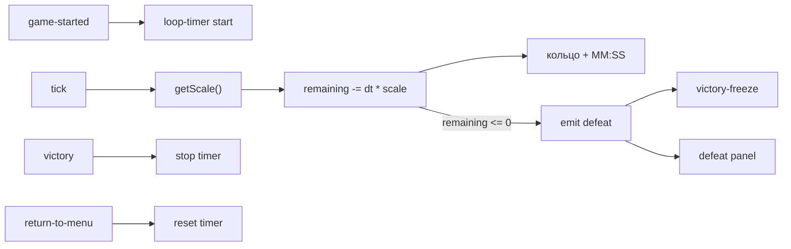

# Таймер петли (Фаза 5)

> Источник истины для следующей сессии. Копия из Cursor plans (с.68).

## Решения (зафиксировано)

- **Один таймер на всю игру** — старт на `game-started`, travel **не** сбрасывает.
- **UI на `#rightHand`** рядом с [`wrist-travel-remote`](../../js/components/wrist-travel-remote.js) (оранжевый цилиндр меню эпох).
- **Время мира:** `remaining -= dtSec * time-scale.getScale()` — realtime и slo-mo (включая forced slo-mo travel-меню) синхронны с миром.
- **v1 длительность:** одно число в config (по умолчанию **5:00**); позже можно разнести по сложностям.

## Архитектура

## Микро-шаги

### 1. Config

В [`js/config.js`](../../js/config.js) блок `loopTimer`:

- `durationSec: 300`
- `position` local `#rightHand` — рядом с пультом (`wristTravelRemote.position` ≈ `{x:0, y:0.13, z:-0.01}`), например сдвиг по X/Y (~0.05–0.08 м), подогнать на Quest
- `radius`, `tube`, цвета cyan (`#33e0ff` / `#66f5ff`), толщина полоски
- `warnBelowSec` (опционально, мигание когда мало времени)

### 2. Компонент `loop-timer` на `#rightHand`

Новый файл [`js/components/loop-timer.js`](../../js/components/loop-timer.js) + подключение в [`index.html`](../../index.html) рядом с `wrist-travel-remote`.

**Логика:**

| Событие | Действие |
|---|---|
| `game-started` | `remaining = durationSec`, running |
| `tick` | если running и не victory-freeze → вычесть `dt * getScale()`; обновить UI |
| `victory` | stop (не поражение) |
| `return-to-menu` | stop + hide |
| `remaining <= 0` | один раз `scene.emit('defeat')` |

**Визуал (без PNG):**

- Кольцо: `THREE.RingGeometry` / `Tube` / canvas-дуга — cyan дуга, длина = `remaining / duration` (уменьшается по окружности).
- Центр: маленькая canvas-плоскость с текстом `M:SS` (или `MM:SS`).
- Anchor `a-entity` sibling к пульту, не кликабельный.

### 3. Поражение

- [`victory-freeze.js`](../../js/components/victory-freeze.js): слушать `defeat` так же, как `victory` (стоп волн, velocity 0).
- [`victory-ui.js`](../../js/components/victory-ui.js): на `defeat` показать ту же плашку с заголовком **DEFEAT** (или `CONFIG.defeat.ui.titleText`), кнопки Restart / Main Menu — те же `_doRestart` / `_doMainMenu`.
- [`wrist-travel-remote`](../../js/components/wrist-travel-remote.js) `_isBlocked`: учитывать показанный defeat-UI (как victory).

### 4. Документы

Обновить [`CURRENT_TASK.md`](../../CURRENT_TASK.md): галочка «таймер петли»; чек-лист QA.

## Не делать в этом срезе

- Бита / hazardLevel (отдельные шаги Фазы 5).
- Сброс таймера при travel.
- Новые PNG-ассеты комикса.

## Чек-лист QA

1. Старт → на правом запястье кольцо + время рядом с оранжевым пультом.
2. Стоишь неподвижно (slo-mo) → секунды идут медленно; двигаешься → быстрее.
3. Travel-меню (forced slo-mo) → таймер тоже замедляется, не сбрасывается.
4. Прыжок эпох → время продолжается с того же остатка.
5. Дождался 0 → freeze + DEFEAT → Restart / Menu работают.
6. Победа раньше нуля → таймер стоп, victory как сейчас.
7. F12 без красных.
